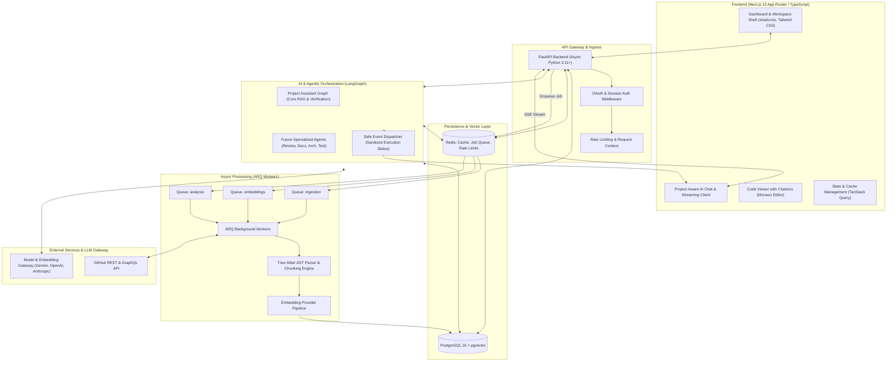
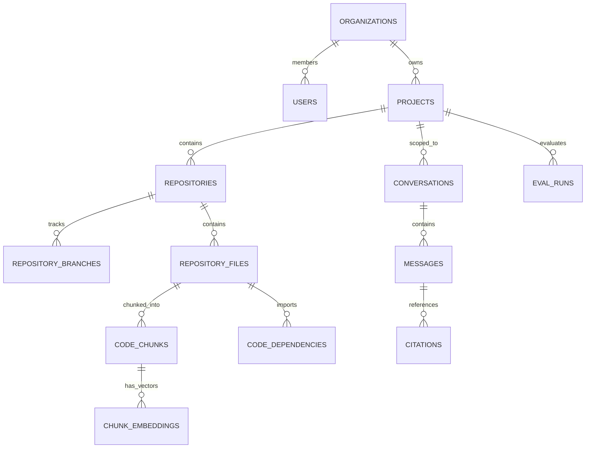
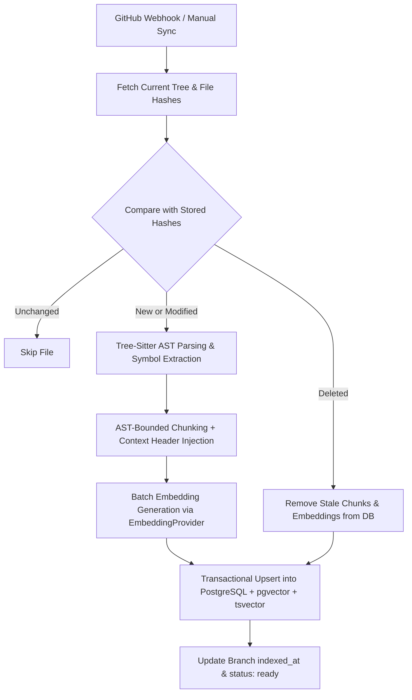
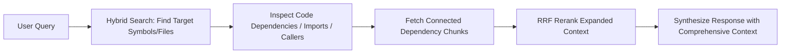
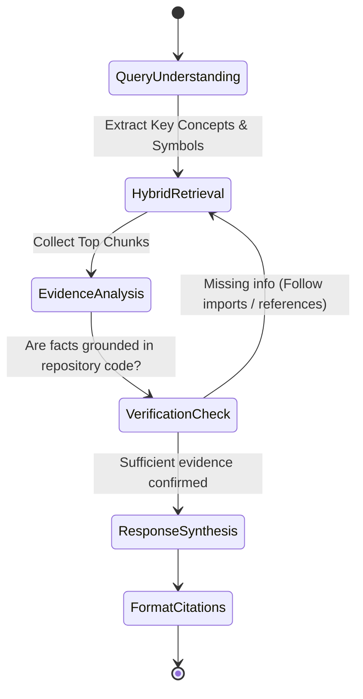

# Forge AI — System Architecture Specification

## 1. Executive Summary & Vision

**Forge AI** is an enterprise-grade AI software engineering platform. Rather than acting as a superficial wrapper around an LLM chat endpoint, Forge AI connects directly to GitHub repositories, continuously indexes codebase structure, commits, symbols, and documentation, and executes multi-step autonomous engineering workflows via **LangGraph**, **pgvector**, and the **Model Context Protocol (MCP)**.

The system is designed with an incremental implementation methodology: we establish an observable, testable foundation first, followed by ingestion, hybrid retrieval, a core LangGraph Project Assistant, and subsequently specialized engineering workflows.

---

## 2. High-Level System Architecture



---

## 3. Monorepo Repository Structure

A clean, modular monorepo structure separating concerns with strict domain boundaries:

```text
ForgeAi/
├── .github/
│   ├── workflows/
│   │   ├── ci-backend.yml
│   │   ├── ci-frontend.yml
│   │   └── lint-and-typecheck.yml
├── docs/
│   ├── architecture.md
│   ├── roadmap.md
│   ├── decisions.md
│   ├── security.md
│   └── evaluation.md
├── frontend/                     # Next.js 15 App Router (TypeScript)
│   ├── src/
│   │   ├── app/                  # Route handlers and page layouts
│   │   │   ├── (auth)/           # Login, GitHub callback
│   │   │   ├── (dashboard)/      # Projects, Settings, Organizations
│   │   │   └── (workspace)/[projectId]/
│   │   │       ├── chat/         # Project-aware AI chat
│   │   │       ├── code-review/  # PR review (Future Phase)
│   │   │       ├── docs/         # Generated docs (Future Phase)
│   │   │       ├── architecture/ # Architecture explorer (Future Phase)
│   │   │       ├── api-explorer/ # API catalog (Future Phase)
│   │   │       └── settings/     # Ingestion & index management
│   │   ├── components/           # Atomic & domain components
│   │   │   ├── ui/               # shadcn/ui primitives
│   │   │   ├── chat/             # Streaming markdown, citations, safe status badges
│   │   │   ├── code/             # Monaco code & diff viewer
│   │   │   └── layout/           # App shell, sidebar, header
│   │   ├── hooks/                # Custom React hooks (streaming, queries)
│   │   ├── lib/                  # Utilities, API client, auth helpers
│   │   └── types/                # Shared TypeScript DTOs and API interfaces
│   ├── package.json
│   ├── tsconfig.json
│   └── tailwind.config.ts
├── backend/                      # FastAPI Python application
│   ├── app/
│   │   ├── api/                  # REST and WebSocket endpoints
│   │   │   ├── v1/
│   │   │   │   ├── auth.py
│   │   │   │   ├── organizations.py
│   │   │   │   ├── projects.py
│   │   │   │   ├── repositories.py
│   │   │   │   ├── ingestion.py
│   │   │   │   ├── chat.py
│   │   │   │   ├── health.py
│   │   │   │   └── evaluations.py
│   │   │   └── router.py
│   │   ├── core/                 # App configuration, security, logging
│   │   │   ├── config.py
│   │   │   ├── database.py       # SQLAlchemy async session manager
│   │   │   ├── redis.py          # Redis connection pool
│   │   │   ├── security.py       # AES-256-GCM credential encryption, JWT
│   │   │   ├── telemetry.py      # Structured logging & metrics
│   │   │   └── exceptions.py
│   │   ├── models/               # SQLAlchemy ORM Models
│   │   │   ├── base.py
│   │   │   ├── auth.py           # User, Organization, Membership
│   │   │   ├── project.py        # Project, Repository, RepositoryBranch
│   │   │   ├── codebase.py       # RepositoryFile, CodeChunk, ChunkEmbedding, CodeDependency
│   │   │   ├── chat.py           # Conversation, Message, Citation
│   │   │   └── evaluation.py     # EvalDataset, EvalRun, MetricResult
│   │   ├── schemas/              # Pydantic validation & serialization models
│   │   ├── services/             # Core business logic
│   │   │   ├── github/           # GitHub client & repository sync
│   │   │   ├── parser/           # Tree-sitter AST parsing & chunking
│   │   │   ├── embedding/        # EmbeddingProvider abstraction
│   │   │   ├── retrieval/        # Hybrid search (pgvector + fulltext + RRF)
│   │   │   ├── llm/              # LLMGateway provider abstraction
│   │   │   └── evaluation/       # Lightweight evaluation harness
│   │   ├── agents/               # LangGraph state graphs & workflows
│   │   │   ├── state.py          # ProjectAssistantState schema
│   │   │   ├── project_assistant.py # Core LangGraph Assistant
│   │   │   └── tools/            # Retrieval and file lookup tools
│   │   └── workers/              # ARQ background worker functions
│   │       ├── main.py           # ARQ worker entrypoint & queue definitions
│   │       ├── ingestion_tasks.py
│   │       ├── embedding_tasks.py
│   │       └── analysis_tasks.py
│   ├── alembic/                  # Database migrations
│   ├── tests/                    # Unit and integration tests
│   │   ├── unit/
│   │   └── integration/
│   ├── pyproject.toml
│   └── Dockerfile
├── docker-compose.yml            # Local orchestration (Postgres+pgvector, Redis, API, Worker)
└── README.md
```

---

## 4. Database Schema (PostgreSQL + pgvector)

All entities enforce multi-tenant isolation via `organization_id` or `project_id`.



### Entity Specifications

1. **`organizations` & `memberships`**:
   - `id (UUID PK)`, `name (VARCHAR)`, `slug (VARCHAR UNIQUE)`, `created_at`, `updated_at`.
   - `memberships`: `user_id`, `organization_id`, `role (enum: owner, admin, member)`.

2. **`users`**:
   - `id (UUID PK)`, `email (VARCHAR UNIQUE)`, `full_name (VARCHAR)`, `avatar_url (VARCHAR)`, `encrypted_github_token (TEXT)`, `created_at`.

3. **`projects`**:
   - `id (UUID PK)`, `organization_id (UUID FK)`, `name (VARCHAR)`, `description (TEXT)`, `settings (JSONB)`, `created_at`.

4. **`repositories` & `repository_branches`**:
   - `id (UUID PK)`, `project_id (UUID FK)`, `github_repo_id (BIGINT)`, `full_name (VARCHAR, e.g. 'org/repo')`, `default_branch (VARCHAR)`, `is_private (BOOLEAN)`, `indexing_status (enum: pending, indexing, ready, failed)`.
   - `repository_branches`: `id (UUID PK)`, `repository_id (UUID FK)`, `name (VARCHAR)`, `latest_commit_sha (VARCHAR(40))`, `indexed_at (TIMESTAMP)`.

5. **`repository_files`**:
   - `id (UUID PK)`, `repository_id (UUID FK)`, `branch_id (UUID FK)`, `file_path (VARCHAR(1024))`, `file_name (VARCHAR(255))`, `extension (VARCHAR(32))`, `language (VARCHAR(64))`, `size_bytes (INTEGER)`, `content_hash (VARCHAR(64))`, `is_binary (BOOLEAN)`.
   - Indexes: `(repository_id, branch_id, file_path)` UNIQUE.

6. **`code_chunks`**:
   - `id (UUID PK)`, `file_id (UUID FK)`, `repository_id (UUID FK)`, `chunk_index (INTEGER)`, `chunk_type (enum: function, class, method, module, block, markdown_section)`, `symbol_name (VARCHAR(255) NULL)`, `start_line (INTEGER)`, `end_line (INTEGER)`, `content (TEXT)`, `token_count (INTEGER)`, `search_vector (tsvector - generated from content & symbol_name)`.
   - GIN Index on `search_vector` for keyword/identifier lookup.

7. **`chunk_embeddings`** (Multi-model / Multi-version vector support):
   - `id (UUID PK)`, `chunk_id (UUID FK)`, `provider (VARCHAR(32))`, `model (VARCHAR(64))`, `dimension (INTEGER)`, `embedding_version (INTEGER DEFAULT 1)`, `embedding (vector)`, `created_at (TIMESTAMP)`.
   - HNSW Index on `embedding` with cosine distance for approximate nearest-neighbor search.

8. **`code_dependencies`** (Future dependency-aware retrieval foundation):
   - `id (UUID PK)`, `file_id (UUID FK)`, `repository_id (UUID FK)`, `source_symbol (VARCHAR(255) NULL)`, `target_symbol (VARCHAR(255) NULL)`, `imported_path (VARCHAR(1024))`, `dependency_type (enum: import, call, inherit, implements)`.

9. **`conversations` & `messages`**:
   - `conversations`: `id (UUID PK)`, `project_id (UUID FK)`, `user_id (UUID FK)`, `title (VARCHAR)`, `context_branch_id (UUID FK)`.
   - `messages`: `id (UUID PK)`, `conversation_id (UUID FK)`, `sender (enum: user, assistant, system)`, `content (TEXT)`, `token_count (INTEGER)`, `model_used (VARCHAR)`, `latency_ms (INTEGER)`.

10. **`citations`**:
    - `id (UUID PK)`, `message_id (UUID FK)`, `chunk_id (UUID FK)`, `file_path (VARCHAR)`, `start_line (INTEGER)`, `end_line (INTEGER)`, `relevance_score (FLOAT)`.

11. **`eval_datasets` & `eval_runs`**:
    - `eval_datasets`: `id (UUID PK)`, `project_id (UUID FK)`, `name (VARCHAR)`, `test_cases (JSONB)`.
    - `eval_runs`: `id (UUID PK)`, `dataset_id (UUID FK)`, `model_name (VARCHAR)`, `retrieval_recall_k (FLOAT)`, `citation_accuracy (FLOAT)`, `groundedness_score (FLOAT)`, `avg_latency_ms (INTEGER)`, `total_tokens (INTEGER)`, `estimated_cost_usd (DECIMAL(10,6))`.

---

## 5. API Boundary Specification

### REST Endpoints
* **Authentication**:
  * `POST /api/v1/auth/github/login` (Initiates OAuth)
  * `GET /api/v1/auth/github/callback` (Completes OAuth, returns JWT session)
  * `GET /api/v1/auth/me` (Current authenticated user profile)
* **Projects & Repositories**:
  * `GET /api/v1/projects`, `POST /api/v1/projects`
  * `GET /api/v1/projects/{project_id}/repositories`
  * `POST /api/v1/projects/{project_id}/repositories/connect`
* **Ingestion & Indexing**:
  * `POST /api/v1/projects/{project_id}/repositories/{repo_id}/index` (Triggers ARQ full or incremental ingestion)
  * `GET /api/v1/projects/{project_id}/repositories/{repo_id}/status` (Polling/Status endpoint)
* **Retrieval & Files**:
  * `POST /api/v1/projects/{project_id}/search/hybrid` (Search testing endpoint)
  * `GET /api/v1/projects/{project_id}/files/{file_id}` (Retrieve file source)
* **AI Conversations & Streaming**:
  * `POST /api/v1/projects/{project_id}/conversations` (Create conversation session)
  * `GET /api/v1/projects/{project_id}/conversations/{conv_id}/messages` (History)
  * `POST /api/v1/projects/{project_id}/conversations/{conv_id}/messages/stream` (SSE streaming token-by-token + safe execution events + citations)
* **Health & Diagnostics**:
  * `GET /api/v1/health` (Checks DB connection, Redis pool, and ARQ queue readiness)

---

## 6. Repository Ingestion & Incremental Indexing Engine

### Initial Supported Language Scope
- **TypeScript** (`.ts`, `.tsx`)
- **JavaScript** (`.js`, `.jsx`, `.mjs`, `.cjs`)
- **Python** (`.py`)
- **Markdown** (`.md`, `.mdx`)
- **JSON** (`.json`)
- **YAML** (`.yaml`, `.yml`)

*(Additional languages like Go, Rust, Java, and C/C++ are documented as future extensions).*

### Ingestion & Incremental Sync Workflow



#### Full vs. Incremental Ingestion:
1. **Incremental Ingestion (Default)**: Compares SHA-256 content hashes of files between the indexed commit and the latest branch commit. Only new, modified, or deleted files are parsed, chunked, embedded, or pruned.
2. **Full Re-Index (Recovery Mode)**: Purges all chunks and embeddings for the repository branch and re-processes all files from scratch.

---

## 7. Hybrid Retrieval Architecture & Dependency Awareness

### 3-Stage Hybrid Retrieval
1. **Dense Vector Search**: Approximate nearest neighbor search in `pgvector` using HNSW index and cosine distance.
2. **Sparse Full-Text Search**: PostgreSQL `ts_rank_cd` on GIN-indexed `tsvector` generated from code and symbol identifiers.
3. **Exact Path & Symbol Filtering**: Exact matching on symbol names and file paths.

Combined via **Reciprocal Rank Fusion (RRF)**:
$$RRF(d) = \sum_{m \in M} \frac{1}{60 + r_m(d)}$$

### Future Dependency-Aware Retrieval Flow


---

## 8. LangGraph Initial Agent Architecture: Project Assistant

Forge AI begins with a single, highly capable **Project Assistant** graph rather than premature multi-agent complexity:



### Safe Agent Observability Model
To protect internal reasoning models and avoid leaking sensitive or unrefined reasoning traces to users, the frontend receives only structured, high-level execution status events via SSE:

| Emitted Safe Event | UI Display Text | Purpose |
| :--- | :--- | :--- |
| `event: understanding_query` | "Understanding request..." | Indicates query decomposition & intent parsing |
| `event: searching_repository` | "Searching repository & symbols..." | Indicates vector & keyword search |
| `event: retrieving_files` | "Retrieving relevant files..." | Indicates chunk retrieval from database |
| `event: analyzing_evidence` | "Analyzing code context..." | Indicates evidence evaluation |
| `event: validating_sources` | "Validating references..." | Indicates fact-grounding verification |
| `event: generating_response` | Token stream (`data: ...`) | Emits final synthesized response tokens |
| `event: citations` | Citation pills | Emits verified source references and line numbers |

*Private model internal chain-of-thought is strictly omitted from client streams.*

---

## 9. EmbeddingProvider & LLMGateway Abstractions

### EmbeddingProvider Abstraction
```python
class EmbeddingProvider(ABC):
    @abstractmethod
    async def embed_documents(self, texts: List[str]) -> List[List[float]]:
        """Generate embeddings for a batch of text chunks."""
        pass

    @property
    @abstractmethod
    def provider_name(self) -> str: ...
    @property
    @abstractmethod
    def model_name(self) -> str: ...
    @property
    @abstractmethod
    def dimension(self) -> int: ...
    @property
    @abstractmethod
    def version(self) -> int: ...
```

Supported providers:
- **Google Gemini** (`text-embedding-004`, 768 dimensions)
- **OpenAI** (`text-embedding-3-small`, 1536 dimensions; `text-embedding-3-large`, 3072 dimensions)

### LLMGateway Abstraction
- Provider-agnostic model routing (Google Gemini, OpenAI, Anthropic).
- Task-complexity routing: lightweight model for intent classification & query expansion; high-reasoning model for response synthesis.
- Token consumption and cost telemetry tracking.

---

## 10. Background Processing with ARQ

Background asynchronous processing is managed strictly via **ARQ** backed by Redis:

- **Queue Architecture**:
  - `ingestion`: Long-running repository cloning, AST parsing, and chunking tasks.
  - `embeddings`: Batch embedding generation with rate-limit handling and backoff retries.
  - `analysis`: Heavy multi-hop dependency analysis and evaluation runs.
- **Worker Configuration**:
  - Max concurrent jobs configured per queue.
  - Redis connection pool with automated reconnection.
  - Job timeout and failure retry policies with exponential backoff.

---

## 11. Security Model & Credential Protection

1. **Credential Encryption**:
   - User GitHub OAuth access tokens and Personal Access Tokens are encrypted at rest using **AES-256-GCM** (Authenticated Encryption with Associated Data).
   - Encryption keys are loaded strictly from environment secrets.
2. **Untrusted Repository Content Boundary**:
   - Ingested repository content (code, comments, markdown, commit messages) is treated as untrusted user input.
   - All repository context injected into LLM prompts is isolated within strict XML tags: `<repository_context>` with special character escaping to defend against indirect prompt injection.
3. **Tenant Isolation**:
   - Multi-tenant isolation is enforced at the database query level with mandatory `organization_id` / `project_id` filters.

---

## 12. Lightweight AI Evaluation Framework

The initial evaluation framework is custom, transparent, and lightweight:

1. **Curated Repository Evaluation Dataset**:
   - Standard set of repository-specific questions.
   - Expected relevant files and symbol identifiers.
   - Ground truth answer criteria.
2. **Evaluated Metrics**:
   - **Retrieval Recall@K**: Did top-K retrieved chunks include expected source files?
   - **Citation Accuracy**: Do cited line ranges match the actual implementation?
   - **Answer Groundedness**: Is the answer supported by retrieved chunks without unsupported claims?
   - **Latency (ms)**: Time to first token and total response duration.
   - **Token Usage & Estimated Cost ($)**: Total prompt and completion tokens tracked per evaluation run.
