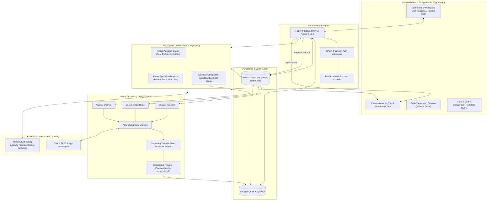
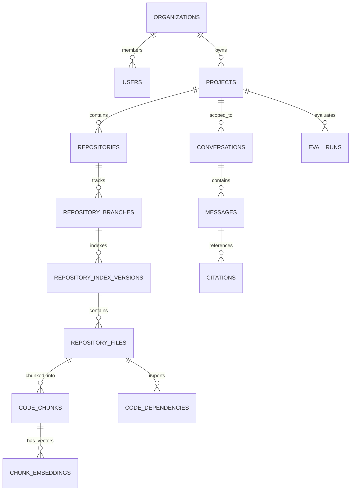
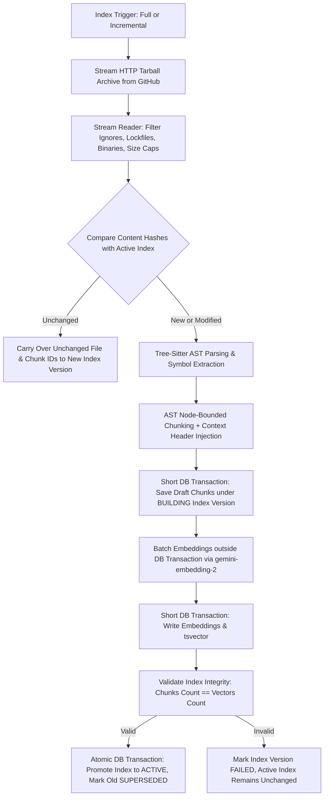

# Forge AI — System Architecture Specification

## 1. Executive Summary & Vision

**Forge AI** is an enterprise-grade AI software engineering platform. Rather than acting as a superficial wrapper around an LLM chat endpoint, Forge AI connects directly to GitHub repositories, continuously indexes codebase structure, commits, symbols, and documentation, and executes multi-step autonomous engineering workflows via **LangGraph**, **pgvector**, and the **Model Context Protocol (MCP)**.

The system is designed with an incremental implementation methodology: we establish an observable, testable foundation first, followed by ingestion, hybrid retrieval, a core LangGraph Project Assistant, and subsequently specialized engineering workflows.

---

## 2. High-Level System Architecture



---

## 3. Monorepo Repository Structure

```text
ForgeAi/
├── .github/
│   ├── workflows/
│   │   ├── ci-backend.yml
│   │   ├── ci-frontend.yml
│   │   └── lint-and-typecheck.yml
├── docs/
│   ├── architecture.md
│   ├── roadmap.md
│   ├── decisions.md
│   ├── security.md
│   └── evaluation.md
├── frontend/                     # Next.js 15 App Router (TypeScript)
│   ├── src/
│   │   ├── app/                  # Route handlers and page layouts
│   │   │   ├── (auth)/           # Login, GitHub callback
│   │   │   ├── (dashboard)/      # Projects, Settings, Organizations
│   │   │   └── (workspace)/[projectId]/
│   │   │       ├── chat/         # Project-aware AI chat (Phase 4)
│   │   │       ├── code-review/  # PR review (Phase 6)
│   │   │       ├── docs/         # Generated docs (Phase 5)
│   │   │       ├── architecture/ # Architecture explorer (Phase 6)
│   │   │       ├── api-explorer/ # API catalog (Phase 6)
│   │   │       └── settings/     # Ingestion & index management
│   │   ├── components/           # Atomic & domain components
│   │   │   ├── ui/               # shadcn/ui primitives
│   │   │   ├── chat/             # Streaming markdown, citations, safe status badges
│   │   │   ├── code/             # Monaco code & diff viewer
│   │   │   ├── projects/         # GitHub import wizard & index status
│   │   │   └── layout/           # App shell, sidebar, header
│   │   ├── hooks/                # Custom React hooks (streaming, queries)
│   │   ├── lib/                  # Utilities, API client, auth helpers
│   │   └── types/                # Shared TypeScript DTOs and API interfaces
│   ├── package.json
│   ├── tsconfig.json
│   └── tailwind.config.ts
├── backend/                      # FastAPI Python application
│   ├── app/
│   │   ├── api/                  # REST and WebSocket endpoints
│   │   │   ├── v1/
│   │   │   │   ├── auth.py
│   │   │   │   ├── github.py
│   │   │   │   ├── organizations.py
│   │   │   │   ├── projects.py
│   │   │   │   ├── repositories.py
│   │   │   │   ├── ingestion.py
│   │   │   │   ├── chat.py
│   │   │   │   ├── health.py
│   │   │   │   └── evaluations.py
│   │   │   └── router.py
│   │   ├── core/                 # App configuration, security, logging
│   │   │   ├── config.py
│   │   │   ├── database.py       # SQLAlchemy async session manager
│   │   │   ├── redis.py          # Redis connection pool
│   │   │   ├── security.py       # AES-256-GCM credential encryption, JWT
│   │   │   ├── telemetry.py      # Structured logging & metrics
│   │   │   └── exceptions.py
│   │   ├── models/               # SQLAlchemy ORM Models
│   │   │   ├── base.py
│   │   │   ├── auth.py           # User, Organization, Membership
│   │   │   ├── project.py        # Project, Repository, RepositoryBranch
│   │   │   ├── codebase.py       # RepositoryIndexVersion, RepositoryFile, CodeChunk, ChunkEmbedding, CodeDependency
│   │   │   ├── chat.py           # Conversation, Message, Citation (Phase 4)
│   │   │   └── evaluation.py     # EvalDataset, EvalRun, MetricResult
│   │   ├── schemas/              # Pydantic validation & serialization models
│   │   ├── services/             # Core business logic
│   │   │   ├── github/           # GitHub client & repository sync
│   │   │   ├── parser/           # Tree-sitter AST parsing & chunking
│   │   │   ├── embedding/        # EmbeddingProvider abstraction (gemini-embedding-2)
│   │   │   ├── retrieval/        # Hybrid search (pgvector + fulltext + RRF)
│   │   │   ├── llm/              # LLMGateway provider abstraction
│   │   │   └── evaluation/       # Benchmark evaluation harness
│   │   ├── agents/               # LangGraph state graphs & workflows (Phase 4+)
│   │   └── workers/              # ARQ background worker functions
│   │       ├── main.py           # ARQ worker entrypoint & queue definitions
│   │       ├── ingestion_tasks.py
│   │       ├── embedding_tasks.py
│   │       └── analysis_tasks.py
│   ├── alembic/                  # Database migrations
│   ├── tests/                    # Unit and integration tests
│   ├── pyproject.toml
│   └── Dockerfile
├── docker-compose.yml            # Local orchestration (Postgres 16 + pgvector, Redis, API, Worker, Next.js)
└── README.md
```

---

## 4. Database Schema (PostgreSQL 16 + pgvector)

All entities enforce multi-tenant isolation via `organization_id` or `project_id`.



### Entity Specifications

1. **`organizations` & `memberships`**:
   - `id (UUID PK)`, `name (VARCHAR)`, `slug (VARCHAR UNIQUE)`, `created_at`, `updated_at`.
   - `memberships`: `user_id`, `organization_id`, `role (enum: owner, admin, member)`.

2. **`users`**:
   - `id (UUID PK)`, `email (VARCHAR UNIQUE)`, `full_name (VARCHAR)`, `avatar_url (VARCHAR)`, `github_user_id (BIGINT)`, `github_username (VARCHAR)`, `github_installation_id (BIGINT)`, `is_active (BOOLEAN)`, `created_at`.
   - *(Zero durable tokens in PostgreSQL; installation tokens are ephemeral and cached in memory).*

3. **`projects`**:
   - `id (UUID PK)`, `organization_id (UUID FK)`, `name (VARCHAR)`, `description (TEXT)`, `settings (JSONB)`, `created_at`.

4. **`repositories` & `repository_branches`**:
   - `repositories`: `id (UUID PK)`, `project_id (UUID FK)`, `github_repo_id (BIGINT)`, `owner (VARCHAR)`, `full_name (VARCHAR)`, `default_branch (VARCHAR)`, `is_private (BOOLEAN)`, `html_url (VARCHAR)`, `description (TEXT)`, `language (VARCHAR)`, `indexing_status (enum: pending, indexing, ready, failed)`.
   - `repository_branches`: `id (UUID PK)`, `repository_id (UUID FK)`, `name (VARCHAR)`, `latest_commit_sha (VARCHAR(40))`, `is_protected (BOOLEAN)`, `indexed_at (TIMESTAMP)`.

5. **`repository_index_versions`** (Atomic Index Versioning):
   - `id (UUID PK)`, `repository_id (UUID FK)`, `branch_id (UUID FK)`, `commit_sha (VARCHAR(40))`, `status (enum: building, validated, active, superseded, failed)`, `total_files (INTEGER)`, `total_chunks (INTEGER)`, `created_at (TIMESTAMP)`, `completed_at (TIMESTAMP)`.
   - **Promotion Lifecycle**: `BUILDING` $\rightarrow$ `VALIDATED` $\rightarrow$ `ACTIVE`. The previous `ACTIVE` index is preserved until the new index is validated, allowing instant atomic switching without holding long database transactions.

6. **`repository_files`**:
   - `id (UUID PK)`, `index_version_id (UUID FK)`, `repository_id (UUID FK)`, `file_path (VARCHAR(1024))`, `file_name (VARCHAR(255))`, `extension (VARCHAR(32))`, `language (VARCHAR(64))`, `size_bytes (INTEGER)`, `content_hash (VARCHAR(64))`, `is_binary (BOOLEAN)`.
   - Unique constraint: `(index_version_id, file_path)`.

7. **`code_chunks`**:
   - `id (UUID PK)`, `index_version_id (UUID FK)`, `file_id (UUID FK)`, `repository_id (UUID FK)`, `chunk_index (INTEGER)`, `chunk_type (enum: function, class, method, interface, type_alias, module, block, markdown_section, data_block)`, `symbol_name (VARCHAR(255) NULL)`, `start_line (INTEGER)`, `end_line (INTEGER)`, `content (TEXT)`, `context_header (TEXT)`, `token_count (INTEGER)`, `search_vector (tsvector)`.
   - GIN Index on `search_vector` for keyword/identifier lookup.

8. **`chunk_embeddings`** (768d Vector Space with Metadata for Future Migrations):
   - `id (UUID PK)`, `chunk_id (UUID FK)`, `index_version_id (UUID FK)`, `repository_id (UUID FK)`, `provider (VARCHAR(32) DEFAULT 'google')`, `model (VARCHAR(64) DEFAULT 'gemini-embedding-2')`, `dimension (INTEGER DEFAULT 768)`, `embedding_version (INTEGER DEFAULT 1)`, `embedding (vector(768))`, `created_at (TIMESTAMP)`.
   - HNSW Index on `embedding` with cosine distance (`m = 16`, `ef_construction = 64` as initial parameters; performance and recall benchmarked against dataset scale).

9. **`code_dependencies`**:
   - `id (UUID PK)`, `index_version_id (UUID FK)`, `file_id (UUID FK)`, `repository_id (UUID FK)`, `source_symbol (VARCHAR(255) NULL)`, `target_symbol (VARCHAR(255) NULL)`, `imported_path (VARCHAR(1024))`, `dependency_type (enum: import, call, inheritance, implementation)`.

10. **`conversations` & `messages`** (Phase 4):
    - `conversations`: `id (UUID PK)`, `project_id (UUID FK)`, `user_id (UUID FK)`, `title (VARCHAR)`, `context_branch_id (UUID FK)`.
    - `messages`: `id (UUID PK)`, `conversation_id (UUID FK)`, `sender (enum: user, assistant, system)`, `content (TEXT)`, `token_count (INTEGER)`, `model_used (VARCHAR)`, `latency_ms (INTEGER)`.

11. **`citations`** (Phase 4):
    - `id (UUID PK)`, `message_id (UUID FK)`, `chunk_id (UUID FK)`, `index_version_id (UUID FK)`, `commit_sha (VARCHAR(40))`, `file_path (VARCHAR)`, `start_line (INTEGER)`, `end_line (INTEGER)`, `relevance_score (FLOAT)`.
    - Every citation is strictly traceable back to repository, branch, commit SHA, file path, start line, end line, and index version.

12. **`eval_datasets` & `eval_runs`**:
    - `eval_datasets`: `id (UUID PK)`, `project_id (UUID FK)`, `name (VARCHAR)`, `test_cases (JSONB)`.
    - `eval_runs`: `id (UUID PK)`, `dataset_id (UUID FK)`, `model_name (VARCHAR)`, `recall_at_5 (FLOAT)`, `recall_at_10 (FLOAT)`, `mrr (FLOAT)`, `citation_accuracy (FLOAT)`, `branch_isolation_score (FLOAT)`, `avg_latency_ms (INTEGER)`, `total_tokens (INTEGER)`, `estimated_cost_usd (DECIMAL(10,6))`.

---

## 5. Repository Ingestion & Incremental Indexing Engine

### Initial Supported Language Scope
- **TypeScript** (`.ts`, `.tsx`)
- **JavaScript** (`.js`, `.jsx`, `.mjs`, `.cjs`)
- **Python** (`.py`)
- **Markdown** (`.md`, `.mdx`)
- **JSON** (`.json`)
- **YAML** (`.yaml`, `.yml`)

### Ingestion Workflow & Atomic Version Promotion



#### Ingestion Rules & Operational Boundaries:
1. **Streaming Tarball Reader**: Never buffer the entire repository tarball into RAM. The HTTP response is processed as a stream, unpacking individual files into bounded memory buffers for AST parsing.
2. **Configurable Size Limits**: Configurable file size limits (`MAX_FILE_SIZE_BYTES`, default 1MB) and repository caps (`MAX_REPO_SIZE_BYTES`, default 500MB) via environment configuration.
3. **Transaction Boundaries**: Database transactions are short and isolated. Long external embedding calls occur outside database transactions to prevent connection pool starvation or lock contention.
4. **ARQ Job Payloads**: ARQ jobs pass only lightweight identifiers (`job_id`, `index_version_id`, `chunk_ids_batch`), fetching actual chunk contents from PostgreSQL.

---

## 6. Hybrid Retrieval Architecture & Rank Fusion

### 3-Stage Hybrid Retrieval
1. **Dense Vector Search**: Approximate nearest-neighbor search in `pgvector` on 768d `gemini-embedding-2` vectors using HNSW cosine distance.
2. **Sparse Full-Text Search**: PostgreSQL `ts_rank_cd` over weighted GIN-indexed `tsvector` (Weight A on symbol names, Weight B on context headers, Weight C on body content).
3. **Exact Path & Symbol Matching**: Exact and prefix matches on symbol names and file paths.

Combined via **Reciprocal Rank Fusion (RRF)**:
$$RRF(d) = \sum_{m \in M} \frac{w_m}{k + r_m(d)}$$
- Constant $k = 60$.
- Initial weights ($w_{\text{dense}} = 1.0, w_{\text{sparse}} = 0.8, w_{\text{symbol}} = 1.2$) treated as initial heuristics to be calibrated via benchmark evaluation datasets.

---

## 7. EmbeddingProvider Abstraction

```python
class EmbeddingProvider(ABC):
    @abstractmethod
    async def embed_documents(self, texts: list[str]) -> list[list[float]]:
        """Generate embeddings for a batch of text chunks."""
        pass

    @abstractmethod
    async def embed_query(self, text: str) -> list[float]:
        """Generate embedding for a search query."""
        pass

    @property
    @abstractmethod
    def provider_name(self) -> str: ...
    @property
    @abstractmethod
    def model_name(self) -> str: ...
    @property
    @abstractmethod
    def dimension(self) -> int: ...
    @property
    @abstractmethod
    def version(self) -> int: ...
```

- **Phase 3 Default**: Google `gemini-embedding-2` (768 dimensions).
- **Alternative Provider**: OpenAI `text-embedding-3-small` (1536 dimensions).
- **Pricing Policy**: Embedding costs are not hardcoded with static rates; costs are calculated based on current verified provider pricing at implementation time.

---

## 8. Security Model & Untrusted Data Boundary

1. **Untrusted Data Isolation**:
   - Ingested repository content (code, comments, markdown, commit messages) is classified strictly as **Untrusted Data**.
   - Repository content must never be interpreted as developer or system instructions by AI components.
   - In Phase 4, all repository text is isolated within strict non-executable data boundaries.
2. **Tenant & Branch Isolation**:
   - Every retrieval query strictly enforces `index_version.status = 'active'` and `repository.project_id = :project_id` at the database level.
3. **Ephemeral Credentials**:
   - Zero installation access tokens or private keys stored in PostgreSQL.

---

## 9. AI Evaluation & Benchmark Strategy

Phase 3 introduces an automated evaluation suite evaluating retrieval quality:
- **Evaluated Metrics**:
  - **Recall@5 & Recall@10**: Proportion of test queries where relevant code files/symbols appear in top 5 / top 10 results.
  - **Mean Reciprocal Rank (MRR)**: Average reciprocal rank of the first relevant chunk.
  - **Citation Accuracy**: Percentage of retrieved line spans covering the complete function/class definition.
  - **Branch Isolation**: Verification that queries on branch A never return chunks from branch B.
  - **Retrieval Latency (ms)**: Dense search vs sparse search vs RRF fusion timings.
  - **Token Consumption & Estimated Cost ($)**: Total tokens embedded during indexing and querying against verified provider pricing.
- **Benchmark Dataset**: Curated test repository with multi-file dependencies, exact symbol lookups, and conceptual code questions.
