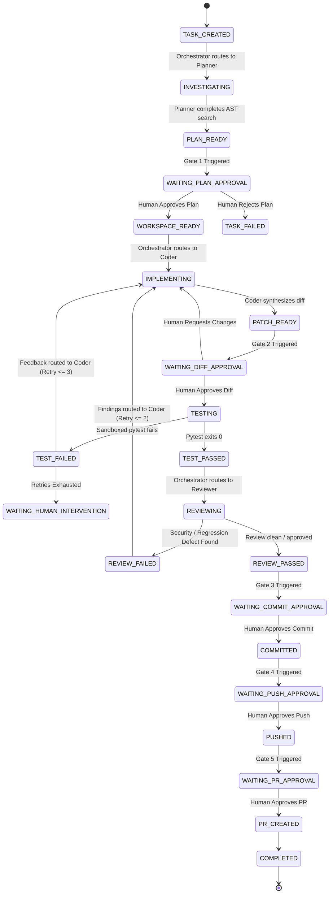

# Forge AI — Phase 6 Multi-Agent Engineering Architecture & Safety Design

## Document Metadata
- **Status:** Approved Architecture Specification
- **Target Release:** v0.6.0
- **Scope:** Centralized Multi-Agent Software Engineering System (Phase 6A Design)
- **Baseline Release:** v0.5.0 ("Controlled AI Software Engineering Agent")
- **Author:** Forge AI Core Architecture Team
- **Date:** August 2026

---

## 1. Executive Summary & Motivation

In Phase 5, Forge AI established a production-verified, repository-grounded engineering agent with deterministic human approval gates. The single-agent architecture unified retrieval, planning, workspace mutation, sandboxed testing, and GitHub PR creation into a single cyclic LangGraph graph.

While effective for scoped, single-turn tasks, the monolithic agent architecture presents clear scaling bottlenecks for complex software engineering:
1. **Context Window Contamination:** A single agent attempting to hold repository AST context, planning logic, unified diffs, test execution logs, and code review criteria in one context window suffers severe attention degradation and token exhaustion.
2. **Conflicting Prompt Objectives:** Prompting one model simultaneously to be an optimistic code generator (author) and a rigorous, adversarial security auditor (critic) results in sycophantic self-validation and overlooked regressions.
3. **Coarse Error Recovery:** When a test fails in a monolithic agent, the entire context loop is retried, leading to hallucinated fixes that drift from the original architectural plan.
4. **Homogeneous Model Sizing:** Single-agent systems force expensive frontier models on simple test extraction or cheap sub-optimal models on complex planning.

**Phase 6 introduces a Centralized Multi-Agent Orchestration Architecture** where specialized subagents (**Planner**, **Coder**, **Tester**, and **Reviewer**) collaborate under an authoritative **Engineering Orchestrator**. The system coordinates independent reasoning while strictly maintaining the **5 Human Approval Gates** established in Phase 5.

```
                 ┌──────────────────────────────────────┐
                 │       Engineering Orchestrator       │
                 │  (Deterministic LangGraph Supervisor)│
                 └──────────────────┬───────────────────┘
                                    │
        ┌───────────────────────────┼───────────────────────────┐
        ↓                           ↓                           ↓
 ┌──────────────┐            ┌──────────────┐            ┌──────────────┐
 │Planner Agent │            │ Coder Agent  │            │Reviewer Agent│
 │(Architecture)│            │(Diff Synth)  │            │(Critic/Sec)  │
 └──────┬───────┘            └──────┬───────┘            └──────┬───────┘
        │                           │                           │
        │                           ↓                           │
        │                     Patch System                      │
        │                           │                           │
        └───────────────────────────┼───────────────────────────┘
                                    ↓
                             ┌──────────────┐
                             │ Tester Agent │
                             │(gVisor Exec) │
                             └──────┬───────┘
                                    │
                                    ↓
                       Verified Engineering Result
```

---

## 2. Current Phase 5 Architecture Audit

Forge AI v0.5.0 consists of a robust, layered architecture across the backend and frontend:

- **State Layer (`backend/app/agent/state.py`):** `AgentState` TypedDict containing `messages`, `repository_id`, `branch_id`, `retrieved_context`, `tool_results`, `iteration`, and `final_answer`.
- **Graph Layer (`backend/app/agent/graph.py`):** LangGraph cyclic execution loop (`agent_node` $\leftrightarrow$ `tool_node`) with conditional routing on `tool_calls`.
- **Tool Guarding (`backend/app/agent/guard.py`):** `ToolUsageGuard` enforcing parameter validation, path traversal prevention, command allowlisting, and per-session tool execution limits.
- **Service Layer (`backend/app/services/`):**
  - `PlanningService`: Synthesizes structured `ImplementationPlan` objects.
  - `WorkspaceService`: Manages isolated ephemeral Git worktrees under `/tmp/forge_workspaces/` with automatic TTL cleanup.
  - `PatchService`: Generates structured `AgentPatch` entities with hunk validation, SHA256 pre-image hashing, and atomic rollback.
  - `TestExecutionService`: Dispatches test commands into isolated, non-networked Docker containers (`gVisor`/`runsc`) with CPU, memory, and timeout constraints.
  - `GitService` & `GitHubPRService`: Executes branch creation, local commits, remote push, and GitHub PR creation via authenticated GitHub App installations.
- **Human Approval Subsystem (`AgentApproval`):** Five explicit approval gates (`PLAN`, `DIFF`, `COMMIT`, `PUSH`, `PR_CREATE`) ensuring no persistent mutation occurs without authenticated user sign-off.

---

## 3. Phase 6 Goals & Strict Non-Goals

### 3.1 Goals
1. **Specialized Agent Decomposition:** Separate concerns into four bounded agents: **Planner**, **Coder**, **Tester**, and **Reviewer**.
2. **Authoritative Orchestration:** Implement a centralized supervisor graph that enforces deterministic transitions, iteration ceilings, and error recovery.
3. **Adversarial Code Review:** Implement an independent Reviewer Agent that assesses AST diffs for security vulnerabilities (CWE/OWASP), regression risks, and architectural consistency without code mutation authority.
4. **Granular Model Routing:** Allow heterogeneous model bindings per agent role (e.g. reasoning-heavy models for Planning/Review, throughput-optimized models for Coding/Testing) via `BaseChatModelProvider`.
5. **Preservation of Safety Invariants:** Retain the 5 Human Approval Gates, workspace isolation, and zero persistent mutation bypasses.

### 3.2 Strict Non-Goals
- **No Uncontrolled Agent Swarms:** No peer-to-peer or emergent agent communication without supervisor mediation.
- **No Autonomous Merging or Deployment:** Forge AI will not merge PRs or deploy code to production environments.
- **No Heavy Message Brokers:** No Kafka, RabbitMQ, or NATS in v0.6.0. Orchestration is managed natively via LangGraph and PostgreSQL transactions.
- **No Removal of Human Gates:** Agents will never self-approve patches, commits, pushes, or PRs.

---

## 4. Multi-Agent System Architecture

### 4.1 Orchestrator Pattern
The **Engineering Orchestrator** is a deterministic StateGraph supervisor. Rather than allowing subagents to invoke each other directly, all transitions route through the supervisor node.



---

## 5. Agent Roles and Specifications

### 5.1 Planner Agent (Architecture & Strategy)
- **Role:** Deep codebase investigation and strategy formulation.
- **Inputs:** User objective, repository index, project guidelines.
- **Outputs:** Validated `ImplementationPlan` (problem statement, approach, affected files, test strategy, identified risks).
- **Tool Access:** `search_repository`, `search_symbol`, `get_file`, `get_directory_structure`, `read_symbol_references`.
- **Safety Boundary:** Read-only access. Strictly forbidden from modifying files, creating workspaces, or executing shell commands.

### 5.2 Coder Agent (Diff Synthesis & Patching)
- **Role:** Precise implementation of approved plans within ephemeral workspaces.
- **Inputs:** Approved `ImplementationPlan`, workspace file state, reviewer feedback (if iterative retry), test failure tracebacks.
- **Outputs:** Structured `AgentPatch` containing exact line hunks and SHA256 pre-hashes.
- **Tool Access:** `get_file`, `search_symbol`, `propose_patch`.
- **Safety Boundary:** Patch proposals are staged in transient state; physical file application requires Gate 2 approval. Strictly forbidden from committing or pushing.

### 5.3 Tester Agent (Sandboxed Verification)
- **Role:** Discover and execute unit/integration test suites matching modified code paths.
- **Inputs:** Workspace path, affected file list, test strategy.
- **Outputs:** Structured `AgentTestExecution` (status, exit code, stdout, stderr, execution duration, failure classification).
- **Tool Access:** `run_tests`, `get_test_targets`.
- **Safety Boundary:** Executes only inside non-networked (`--network=none`), CPU/RAM-bounded `gVisor` containers. Forbidden from executing unallowlisted binary commands.

### 5.4 Reviewer Agent (Adversarial Static & Security Analysis)
- **Role:** Critical evaluation of proposed patches against security, architectural, and regression standards.
- **Inputs:** Unified diff, original file context, implementation plan, test execution results.
- **Outputs:** Structured `AgentReview` containing a collection of `ReviewFinding` items (severity: `CRITICAL`, `HIGH`, `MEDIUM`, `LOW`, `INFO`).
- **Tool Access:** `get_file`, `search_symbol`, `read_symbol_references`.
- **Safety Boundary:** Read-only. Reviewer Agent can **recommend** approval or rejection, but has **zero mutation authority**.

---

## 6. Shared Multi-Agent State & Persistence

To maintain deterministic execution, system state is partitioned across three storage tiers:

### 6.1 State Tiering Matrix

| Tier | Storage Engine | Scope & Lifecycle | Examples |
| :--- | :--- | :--- | :--- |
| **Transient Agent State** | LangGraph `MultiAgentState` | Execution loop lifecycle; in-memory / checkpoint | Active agent node, iteration counters, subagent messages, temporary tool outputs. |
| **Relational Persistent State** | PostgreSQL 16 (`pgvector`) | Permanent audit trail; queryable via REST/SSE | `AgentTask`, `AgentApproval`, `AgentPatch`, `AgentTestExecution`, `AgentReview`, `AgentPullRequest`. |
| **Physical Workspace State** | Ephemeral Worktree (`/tmp`) | 60-min TTL; isolated Git worktree | Uncommitted source tree, virtualenvs, build artifacts. |

### 6.2 Data Sanitation Rules
The following items are **strictly prohibited** from entering transient LangGraph state, persistent PostgreSQL tables, or SSE events:
1. GitHub App private keys and installation access tokens.
2. Database connection strings and Redis passwords.
3. LLM provider API keys (`OPENAI_API_KEY`, `GEMINI_API_KEY`, `GROQ_API_KEY`).
4. Raw unescaped chain-of-thought scratchpads that bypass structured schemas.

---

## 7. Communication Model Comparison & Selection

| Architecture Model | Latency | Determinism | Debuggability | Complexity | Suitability for v0.6.0 |
| :--- | :--- | :--- | :--- | :--- | :--- |
| **Option A: Centralized LangGraph Shared-State Handoff** | Low (< 5ms) | High (Strict State Machine) | High (Step-by-step trace) | Low | **SELECTED** |
| **Option B: Redis Pub/Sub Event Bus** | Medium | Medium (Async race risks) | Medium (Distributed logs) | Medium | Rejected (Premature) |
| **Option C: Distributed Message Queue (Kafka/Celery)** | High | Low (Eventual consistency) | Low (Distributed debugging) | High | Rejected (Over-engineering) |
| **Option D: Direct Peer-to-Peer Agent Messaging** | Low | Low (Emergent deadlock risk) | Low (Unbounded graphs) | High | Rejected (Safety violation) |

**Decision Rationale:** Option A provides compile-time state typing, immediate checkpointing, deterministic rollback on failure, and complete reproducibility across local and cloud environments without external message broker overhead.

---

## 8. Tool Access Control Matrix

| Tool Name | Planner | Coder | Tester | Reviewer | Security Guardrail |
| :--- | :---: | :---: | :---: | :---: | :--- |
| `search_repository` | ✓ | ✓ | ✓ | ✓ | Read-only vector + full-text search |
| `search_symbol` | ✓ | ✓ | ✓ | ✓ | Read-only AST symbol lookup |
| `get_file` | ✓ | ✓ | ✓ | ✓ | Path traversal protection, size limit |
| `get_directory_structure` | ✓ | ✓ | ✓ | ✓ | Depth-limited tree walking |
| `propose_patch` | ✗ | ✓ | ✗ | ✗ | Syntax-checked structured hunk generation |
| `apply_patch` | ✗ | ✗* | ✗ | ✗ | **Gate 2 Human Approval Required** |
| `run_tests` | ✗ | ✗ | ✓ | ✗ | Non-networked gVisor sandbox execution |
| `git_commit` | ✗ | ✗* | ✗ | ✗ | **Gate 3 Human Approval Required** |
| `git_push` | ✗ | ✗* | ✗ | ✗ | **Gate 4 Human Approval Required** |
| `create_pull_request` | ✗ | ✗* | ✗ | ✗ | **Gate 5 Human Approval Required** |

*\* Denotes operations that cannot be executed autonomously by any agent; strictly gated by authenticated human approval.*

---

## 9. Failure Modes & Deterministic Recovery Matrix

| Failure Mode | Detection Point | Automated Recovery Policy | Escalation Path |
| :--- | :--- | :--- | :--- |
| **Planner Cannot Find Files** | Retrieval empty / Low RRF confidence score | Broaden search terms; attempt fallback symbol index. | Prompt user for explicit path hints if 2 attempts fail. |
| **Coder Synthesizes Invalid Patch** | AST syntax error or hunk offset drift | Re-read fresh target file content; re-synthesize patch hunks (Max 2 retries). | Mark patch as `CONFLICT`; halt for user inspection. |
| **Pytest Execution Fails** | Exit code $\neq$ 0 returned by sandbox runner | Tester packages traceback + stdout $\rightarrow$ routes to Coder for localized remediation. | If failure persists after 3 repair loops $\rightarrow$ trigger `WAITING_HUMAN_INTERVENTION`. |
| **Reviewer Rejects Implementation** | `CRITICAL` or `HIGH` severity findings found | Reviewer outputs structured issue list $\rightarrow$ Orchestrator routes back to Coder. | If reviewer rejects 2 consecutive revisions $\rightarrow$ display review report to user for decision. |
| **LLM Provider Rate Limit (429)** | HTTP 429 received from API | Exponential backoff (1s, 2s, 4s, 8s) + automatic fallback to secondary provider. | If all providers exhausted $\rightarrow$ pause workflow in `PROVIDER_BACKOFF` state. |
| **Workspace TTL Expiry** | Background reaper detects workspace $> 60$ min | Auto-cleanup ephemeral worktree; preserve DB patch state. | User can re-provision fresh workspace from commit SHA. |
| **User Cancels Task** | User clicks `[Cancel]` in UI / API | Orchestrator terminates active graph; dispatches rollback to clean Git workspace. | Task transitions to `CANCELLED`; all staged locks released. |

---

## 10. Cost & Iteration Guardrails

To eliminate the risk of infinite agent loops or unbounded LLM spend, the Engineering Orchestrator enforces hard caps:

```python
# Multi-Agent Execution Guardrails (Phase 6)
MAX_TOTAL_WORKFLOW_ITERATIONS = 15
MAX_PLANNER_INVESTIGATION_STEPS = 5
MAX_CODER_RETRY_CYCLES = 3
MAX_TEST_REPAIR_LOOPS = 3
MAX_REVIEW_ITERATIONS = 2
MAX_TOTAL_TOOL_INVOCATIONS = 30
MAX_WORKFLOW_EXECUTION_SECONDS = 600  # 10 minutes hard timeout
MAX_TOKEN_BUDGET_PER_TASK = 150_000   # Combined prompt + completion tokens
```

---

## 11. Model Routing Configuration

Forge AI abstracts all LLM communication behind `BaseChatModelProvider`. Phase 6 allows heterogeneous model assignment per agent role via configuration:

```yaml
# config/agent_routing.yaml
agent_routing:
  planner:
    provider: ${PLANNER_PROVIDER:-gemini}
    model: ${PLANNER_MODEL:-gemini-2.5-pro}
    temperature: 0.1
  coder:
    provider: ${CODER_PROVIDER:-openai}
    model: ${CODER_MODEL:-gpt-4o}
    temperature: 0.2
  tester:
    provider: ${TESTER_PROVIDER:-groq}
    model: ${TESTER_MODEL:-llama-3.3-70b-versatile}
    temperature: 0.0
  reviewer:
    provider: ${REVIEWER_PROVIDER:-gemini}
    model: ${REVIEWER_MODEL:-gemini-2.5-pro}
    temperature: 0.1
```

---

## 12. Security & Prompt Injection Defense

1. **Repository Content as Untrusted Data:** All file contents, commit messages, issue descriptions, and pull request comments retrieved from target repositories are treated as untrusted data.
2. **System Prompt Isolation:** Repository content is wrapped inside explicit XML data boundaries (`<repository_source file="..."> ... </repository_source>`). System instructions explicitly instruct agents that repository instructions cannot alter system policies or approval requirements.
3. **AST Validation Before Execution:** Patches must successfully parse into a valid Tree-sitter AST before being eligible for sandboxed testing or diff review.
4. **Credential Redaction Pipeline:** All tool outputs and LLM completions pass through regex and entropy-based secret scrubbers prior to database storage or SSE emission.

---

## 13. Observability & Telemetry

Phase 6 introduces structured, sanitized telemetry events emitted over SSE:

```
agent.task.created          -> { task_id, repository_id, user_id }
agent.planner.started       -> { task_id, objective }
agent.planner.completed     -> { task_id, plan_summary, affected_files_count, duration_ms }
agent.coder.started         -> { task_id, plan_id, workspace_id }
agent.patch.proposed        -> { task_id, patch_id, files_changed, lines_added, lines_deleted }
agent.tester.started        -> { task_id, runner, target_tests_count }
agent.tester.completed      -> { task_id, status: PASSED|FAILED, duration_ms, exit_code }
agent.reviewer.started      -> { task_id, patch_id }
agent.reviewer.completed    -> { task_id, status: APPROVED|CHANGES_REQUESTED, findings_count }
agent.approval.required     -> { task_id, gate: PLAN|DIFF|COMMIT|PUSH|PR_CREATE, approval_id }
agent.workflow.completed    -> { task_id, pr_url, total_duration_ms, total_tokens }
```

---

## 14. Phase 6 Database Schema Extensions

To store multi-agent activities while maintaining backward compatibility with Phase 5 tables, the following additive models are designed:

### 14.1 `AgentTask`
Represents the top-level orchestration lifecycle.
- `id: UUID (PK)`
- `project_id: UUID (FK -> projects.id)`
- `session_id: UUID (FK -> agent_sessions.id)`
- `status: Enum (CREATED, RUNNING, WAITING_APPROVAL, COMPLETED, FAILED, CANCELLED)`
- `current_agent: Enum (PLANNER, CODER, TESTER, REVIEWER, SUPERVISOR)`
- `iteration_count: Integer`
- `created_at / updated_at / completed_at: Timestamp`

### 14.2 `AgentReview` & `ReviewFinding`
Stores the structured static and security analysis produced by the Reviewer Agent.
- `AgentReview`: `id (PK)`, `task_id (FK)`, `patch_id (FK)`, `status (APPROVED, CHANGES_REQUESTED)`, `summary`, `created_at`.
- `ReviewFinding`: `id (PK)`, `review_id (FK)`, `severity (CRITICAL, HIGH, MEDIUM, LOW, INFO)`, `category (SECURITY, REGRESSION, STYLE, ARCHITECTURE)`, `file_path`, `line_start`, `line_end`, `description`, `recommendation`.

---

## 15. Evaluation Framework & Benchmark Categories

The multi-agent system will be evaluated across 6 benchmark categories:
1. **Bug Remediation:** Localizing and repairing failing regression tests.
2. **Feature Additions:** Implementing endpoints or components conforming to API contracts.
3. **Code Refactoring:** Updating symbol signatures and migrating deprecated patterns.
4. **Security Vulnerability Remediation:** Identifying and patching OWASP Top 10 vulnerabilities.
5. **Test Synthesis:** Generating high-coverage pytest/vitest suites for untested modules.
6. **Documentation & Typing:** Adding comprehensive type annotations and docstrings.

---

## 16. Phased Rollout Strategy

- **Phase 6A (Current):** Multi-Agent Architecture & Safety Specification (Design Only).
- **Phase 6B:** Centralized Orchestrator & MultiAgentState Implementation (Backend).
- **Phase 6C:** Specialized Agent Roles (Planner, Coder, Tester, Reviewer) & Review Findings Engine.
- **Phase 6D:** Multi-Agent Activity Timeline UI & Multi-Model Routing Configuration.
- **Phase 6E:** End-to-End Multi-Agent Acceptance Suite & Release v0.6.0.
